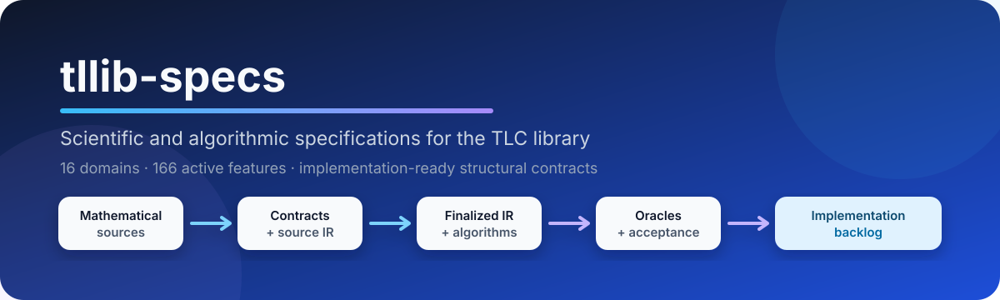
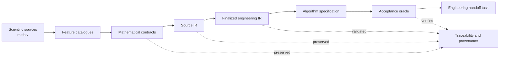

<div align="center">



# tllib-specs

**The specification repository for the TLC scientific library.**

[](https://github.com/Tradition-Learning-Community/tllib-specs/actions/workflows/global-finalization.yml)
[](registry/global-finalization/manifest.yaml)
[](registry/global-finalization/feature-status.yaml)
[](registry/global-finalization/domain-status.yaml)
[](LICENSE)

[Overview](#overview) · [Architecture](#specification-architecture) · [Governance](#engineering-governance) · [Domains](#domains) · [Repository map](#repository-map) · [Feature chain](#working-with-a-feature) · [Validation](#validation) · [Contributing](#contributing)

</div>

---

## Overview

`tllib-specs` contains the **scientific, mathematical, structural, and algorithmic contracts** that define the future `tllib` C++ library and its Python bindings.

This repository is deliberately **upstream of implementation**. Its job is to make every future implementation traceable, testable, and unable to silently replace missing scientific semantics with convenient defaults.

The current integrated specification covers:

| Coverage | Status |
|---|---:|
| Scientific domains | **16** |
| Active features | **166** |
| Mathematical contracts | **166** |
| Source intermediate representations | **166** |
| Source test plans | **166** |
| Finalized engineering IRs | **166** |
| Algorithm specifications | **166** |
| Acceptance oracles | **166** |

The global package is marked [`integrated_structural_specification_finalized`](registry/global-finalization/manifest.yaml). This means the **structural engineering specification is finalized and ready for downstream handoff**. It does not mean that runtime implementation exists here, or that every preserved equation, proof, metric, transition, or evaluator is scientifically executable.

## Why this repository exists

Scientific software often fails at the boundary between theory and code: equations are reinterpreted, unresolved terms receive accidental defaults, similar concepts are merged, and tests validate the implementation rather than the original contract.

TLC uses an explicit compiler-like specification pipeline to prevent that drift:



Every active feature remains connected through the complete chain:

```text
scientific source
  → mathematical contract
  → source IR
  → finalized engineering IR
  → algorithm specification
  → acceptance oracle
  → engineering handoff task
```

## Specification architecture

The repository separates **scientific authority** from **software realization**.

### 1. Scientific sources

The [`maths/`](maths/) directory contains the authoritative domain texts. These files are not rewritten during IR finalization or software planning.

### 2. Source contracts and IR

Each active feature has:

- a mathematical contract in [`registry/math-contracts/`](registry/math-contracts/);
- a source IR in [`registry/ir/`](registry/ir/);
- a source test plan in [`registry/test-plans/`](registry/test-plans/).

### 3. Finalized engineering specifications

Each feature also has:

- a finalized IR in [`registry/optimized-ir/`](registry/optimized-ir/);
- an algorithm specification in [`registry/algorithms/`](registry/algorithms/);
- an acceptance oracle in [`registry/oracles/`](registry/oracles/).

These artifacts describe authorized structural behavior such as validation, immutable representation, traceability, error handling, opaque-value transport, unresolved propagation, and deterministic serialization where declared.

`registry/algorithms/` is the only active and authoritative algorithm specification tree. No parallel root-level algorithm catalogue is maintained.

### 4. Canonical engineering identity

The scoped canonical system under [`registry/symbols/`](registry/symbols/) covers:

- stable identifiers;
- domain-qualified namespaces;
- shared structural types;
- public interfaces;
- explicit aliases;
- mappings to reusable internal representations.

It does **not** rename every theoretical term or require a globally unique mathematical glyph for every concept.

A shared source symbol does not imply a shared identity. A shared internal representation does not imply an alias or scientific equivalence.

### 5. Domain and global integration

Domain packages live in [`registry/domain-finalization/`](registry/domain-finalization/). The integrated library-level specification lives in [`registry/global-finalization/`](registry/global-finalization/), including:

- shared structural types and patterns;
- module interfaces;
- dependency graph;
- engineering waves;
- decision register;
- downstream backlog;
- library specification.

## Engineering governance

### Scientific review remains preserved

The repository records **147 scientific review questions**. They remain scientifically unresolved and fully traceable. Structural finalization does not mark them approved, completed, rejected, merged, or aliased.

Their engineering disposition is conservative and non-blocking:

- keep stable identities distinct unless an explicit alias is approved;
- preserve missing semantics as opaque or unresolved;
- block only feature-scoped scientific execution that requires the missing semantics;
- do not block structural specification closure or engineering handoff.

See [`registry/scientific-review/engineering-disposition.yaml`](registry/scientific-review/engineering-disposition.yaml).

### Identity and representation are separate

TLC distinguishes:

1. **semantic identity** — stable identifier plus qualified namespace;
2. **structural carrier** — reusable engineering representation;
3. **backend storage** — implementation-specific choice outside this repository.

Several distinct concepts may use the same carrier while retaining distinct semantic identities, provenance, and contracts.

### Repository boundary

This repository contains specifications only. Production C++, Python bindings, runtime kernels, packaging, and release artifacts belong in a separate implementation repository.

## Domains

| # | Domain | Active features |
|---:|---|---:|
| 00 | Master | 16 |
| 01 | Disciple | 10 |
| 02 | Community | 8 |
| 03 | Huit Dimensions | 11 |
| 04 | Invariants | 10 |
| 05 | Dynamics | 7 |
| 06 | Theorems | 9 |
| 07 | Message | 6 |
| 08 | Principle | 10 |
| 09 | Values | 14 |
| 10 | Virtues | 10 |
| 11 | Capacities | 15 |
| 12 | Competencies | 13 |
| 13 | Practice | 10 |
| 14 | Lived Experience | 12 |
| 15 | Relations | 5 |
|  | **Total** | **166** |

The authoritative integrated order and counts are recorded in the [global finalization manifest](registry/global-finalization/manifest.yaml).

## Repository map

```text
tllib-specs/
├── maths/                         # Authoritative scientific domain texts
├── registry/
│   ├── symbols/                  # Scoped canonical identifiers and namespaces
│   ├── scientific-review/        # Engineering disposition of preserved review questions
│   ├── math-contracts/           # One mathematical contract per active feature
│   ├── ir/                       # Preserved source intermediate representations
│   ├── test-plans/               # Preserved source test plans
│   ├── optimized-ir/             # Finalized engineering-facing IRs
│   ├── algorithms/               # Sole authoritative algorithm specification tree
│   ├── oracles/                  # Acceptance oracles and test requirements
│   ├── domain-finalization/      # Module specs, patterns, decisions, tasks
│   ├── global-reconciliation/    # Authoritative baseline and feature matrices
│   └── global-finalization/      # Integrated library specification and backlog
├── reports/
│   ├── domain-finalization/      # Per-domain finalization reports
│   └── global-finalization/      # Global finalization and handoff reports
├── tools/
│   ├── domain-finalization/      # Domain validators
│   └── global-finalization/      # Integrated specification validator
├── .github/workflows/            # Specification integrity CI
└── docs/assets/                  # README and documentation visuals
```

## Working with a feature

A feature is identified by a stable ID such as:

```text
TLC-FC-00-MASTER-001
```

Its specification chain can be inspected directly:

```text
registry/math-contracts/TLC-FC-00-MASTER-001/contract.yaml
registry/ir/TLC-FC-00-MASTER-001/ir.yaml
registry/test-plans/TLC-FC-00-MASTER-001/test-plan.yaml
registry/optimized-ir/master/TLC-FC-00-MASTER-001/ir.yaml
registry/algorithms/master/TLC-FC-00-MASTER-001/algorithm.yaml
registry/oracles/master/TLC-FC-00-MASTER-001/oracle.yaml
```

A finalized IR is engineering-facing but still preserves its sources:

```yaml
feature_id: TLC-FC-00-MASTER-001
status: selected_for_master_implementation_specification

traceability:
  contract_ref: registry/math-contracts/TLC-FC-00-MASTER-001/contract.yaml
  ir_registry_ref: registry/ir/TLC-FC-00-MASTER-001/ir.yaml
  source_test_plan_ref: registry/test-plans/TLC-FC-00-MASTER-001/test-plan.yaml

representation:
  implementation_kind: immutable_descriptor

operations:
  - validate_feature_identity
  - validate_exact_reference_sets
  - construct_immutable_provenance
  - emit_declaration_descriptor
  - verify_preservation_obligations
```

The corresponding algorithm explains the ordered behavior, while the oracle defines the acceptance conditions downstream work must satisfy.

## Engineering handoff scope

The specifications authorize downstream work for the shared structural layer, including:

- stable feature and source identifiers;
- domain-qualified semantic identities;
- immutable descriptors;
- exact identity, input, provenance, and reference validation;
- opaque scientific payload carriers;
- unresolved and reservation propagation;
- structured deterministic errors;
- serialization and round-trip behavior where declared;
- module interfaces;
- oracle-driven acceptance suites.

See the [engineering handoff readiness report](reports/global-finalization/implementation-readiness.md), [library specification](registry/global-finalization/library-specification.yaml), and [downstream backlog](registry/global-finalization/implementation-backlog.yaml).

## Scientific boundary

This repository does **not** authorize downstream work to invent missing semantics.

Unless explicitly defined by the source contract, no implementation may introduce:

- numerical solvers or convergence policies;
- thresholds, scores, rankings, or measurement scales;
- theorem proofs or proof completion;
- state-transition rules;
- causal interpretations of relations;
- value, virtue, capacity, or competency evaluation;
- defaults for unresolved scientific parameters.

Unsupported scientific execution must remain explicit, traceable, and rejectable through structured errors or external-evaluator boundaries.

## Validation

The permanent GitHub Actions workflow validates the integrated specification package on relevant changes.

Run the global validator from the repository root:

```bash
python3 tools/global-finalization/validate_global_finalization.py
```

The validator checks, among other things:

- all 16 domain packages are present;
- exactly 166 IRs, algorithms, and oracles are discoverable;
- feature populations match across artifact layers;
- historical Capacities identifiers are not promoted;
- protected scientific sources and source artifacts are unchanged;
- the canonical symbol and engineering-disposition registries are present;
- no active algorithm specification exists outside `registry/algorithms/`;
- no C++ implementation or Python binding is introduced in this repository;
- the Git diff is structurally clean.

Domain-specific validators are available under [`tools/domain-finalization/`](tools/domain-finalization/).

## Downstream roadmap

The integrated backlog organizes future development into dependency-aware waves:

1. shared identifiers, references, opaque values, unresolved propagation, traceability, and errors;
2. independent descriptor modules;
3. remaining structural modules in parallel dependency-aware lots;
4. cross-module acceptance suites;
5. Python bindings after the C++ structural interfaces pass their oracles.

Implementation code belongs in the future implementation repository, not in this specification repository.

## Contributing

Contributions are welcome when they preserve the repository's scientific and traceability guarantees.

Before opening a pull request:

1. identify the affected feature IDs and source artifacts;
2. preserve the authoritative files under `maths/`, source contracts, source IRs, and source test plans unless the contribution is an explicitly approved scientific revision;
3. update all affected finalized IR, algorithm, oracle, module, and task references together;
4. preserve unresolved items rather than replacing them with assumptions;
5. maintain qualified semantic identities and explicit alias rules;
6. keep active algorithm specifications under `registry/algorithms/` only;
7. run the relevant domain validator and the global validator;
8. keep implementation code outside this repository's scope.

A good pull request explains **what changed, why it is authorized, which feature chain is affected, and which validation evidence passed**.

## Project status

| Phase | Status |
|---|---|
| Scientific source organization | Complete |
| Scientific review inventory | Complete: 147 questions preserved |
| Scientific adjudication | Unresolved; non-blocking engineering disposition recorded |
| Mathematical contracts | Complete for 166 active features |
| Source IR and test plans | Complete for 166 active features |
| Finalized engineering IRs | Complete |
| Algorithm specifications | Complete under `registry/algorithms/` |
| Acceptance oracles | Complete |
| Canonical engineering identity | Scoped registry active |
| Domain integration | Complete |
| Global structural specification | Finalized |
| Runtime implementation | Outside this repository |
| Packaging and releases | Outside this repository |

## License

Licensed under the [Apache License 2.0](LICENSE).

---

<div align="center">

**Tradition Learning Community — from scientific theory to verifiable software contracts.**

</div>
